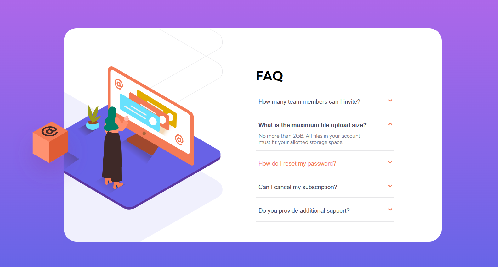

# Frontend Mentor - FAQ accordion card solution

This is a solution to the [FAQ accordion card challenge on Frontend Mentor](https://www.frontendmentor.io/challenges/faq-accordion-card-XlyjD0Oam).

## Table of contents

- [Overview](#overview)
  - [The challenge](#the-challenge)
  - [Screenshot](#screenshot)
  - [Links](#links)
- [My process](#my-process)
  - [Built with](#built-with)
  - [What I learned](#what-i-learned)
- [Author](#author)

## Overview

### The challenge

Users should be able to:

- View the optimal layout for the component depending on their device's screen size
- See hover states for all interactive elements on the page
- Hide/Show the answer to a question when the question is clicked

### Screenshot

| Desktop | Mobile |
| ------------- | ------------- |
|  |  |

| Desktop active | Mobile active |
| -------------- | ------------- |
|  |  |

### Links

- [Github Solution](https://github.com/ShivamManiMaurya/faq-accordion-card)
- [Live site](https://your-live-site-url.com)

## My process

### Built with

- Semantic HTML5 markup
- CSS custom properties
- Flexbox
- CSS Grid
- Mobile-first workflow
- [React](https://reactjs.org/) - JS library

### What I learned

 - clip-path property
 - explored transform property
 - sharing data from different components in react
 - and many other things

## Author

- GitHub page - [Shivam Maurya](https://github.com/ShivamManiMaurya/faq-accordion-card)
- Frontend Mentor - [@shivammaurya](https://www.frontendmentor.io/profile/ShivamManiMaurya)
